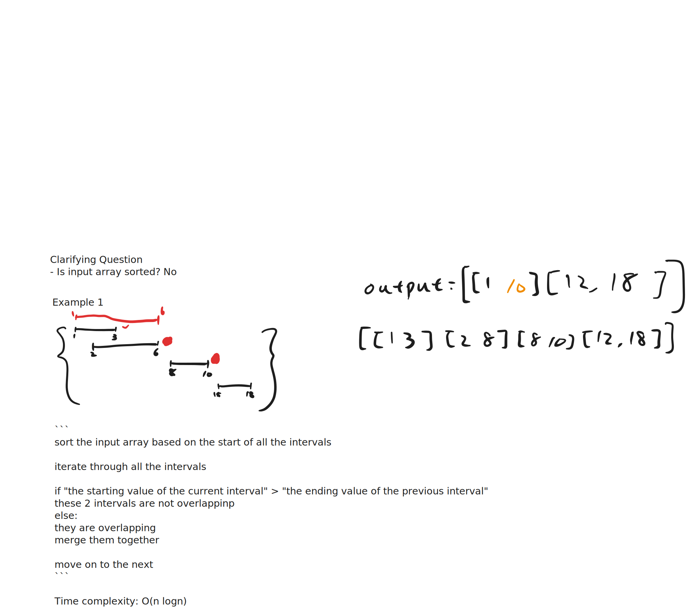

# 56. [Merge Intervals](https://leetcode.com/problems/merge-intervals/)

<iframe width="560" height="315" src="https://www.youtube.com/embed/44H3cEC2fFM?si=j1vQ0wz6SkQm_xw0" title="YouTube video player" frameborder="0" allow="accelerometer; autoplay; clipboard-write; encrypted-media; gyroscope; picture-in-picture; web-share" referrerpolicy="strict-origin-when-cross-origin" allowfullscreen></iframe>

## Summary

| **Solution Approach** | **Explanation (1-minute)** | **Time Complexity** | **Space Complexity** |
| --------------------- | -------------------------- | ------------------- | -------------------- |
| **Sort and Merge**    | Sort intervals by start time. Iterate through sorted intervals, comparing each with the last merged interval. If they overlap, merge by updating the end time to the maximum. Otherwise, add the current interval to results. | $O(n log n)$          | $O(1)$ or $O(n)$         |



## Implementation

=== "Python"

    ```python
    --8<-- "./leetcode/docs/56-merge-intervals/56-merge-intervals.py"
    ```

=== "JavaScript"

    ```javascript
    --8<-- "./leetcode/docs/yyyy/yyyy.js"
    ```

=== "Go"

    ```go
    --8<-- "./leetcode/docs/zzzz/zzzz.go"
    ```
