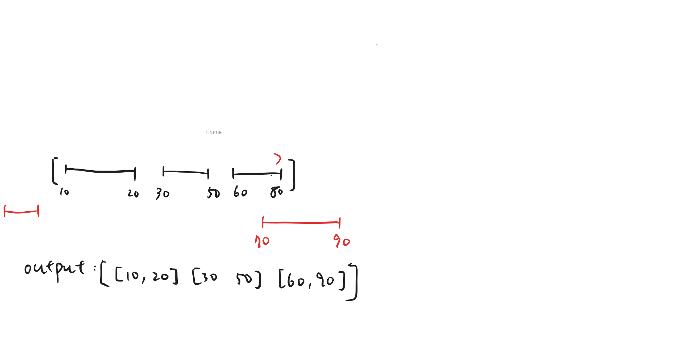

# [57. Insert Interval](https://leetcode.com/problems/insert-interval/description/)


<iframe width="560" height="315" src="https://www.youtube.com/embed/A8NUOmlwOlM?si=X1_Z2Ra7iNMorfaa" title="YouTube video player" frameborder="0" allow="accelerometer; autoplay; clipboard-write; encrypted-media; gyroscope; picture-in-picture; web-share" referrerpolicy="strict-origin-when-cross-origin" allowfullscreen></iframe>


## Summary

| **Solution Approach** | **Explanation (1-minute)** | **Time Complexity** | **Space Complexity** |
| --------------------- | -------------------------- | ------------------- | -------------------- |
| **Linear Scan**       | Iterate through intervals. Handle 3 cases: (1) new interval is completely before current - add new interval and remaining intervals; (2) new interval is completely after current - add current interval to result; (3) overlapping intervals - merge by taking min start and max end, continue merging until no overlap. | O(n) | O(n) |



## Implementation

=== "Python"

    ```python
    --8<-- "./leetcode/docs/57-insert-interval/57-insert-interval.py"
    ```

=== "JavaScript"

    ```javascript
    --8<-- "./leetcode/docs/yyyy/yyyy.js"
    ```

=== "Go"

    ```go
    --8<-- "./leetcode/docs/zzzz/zzzz.go"
    ```
